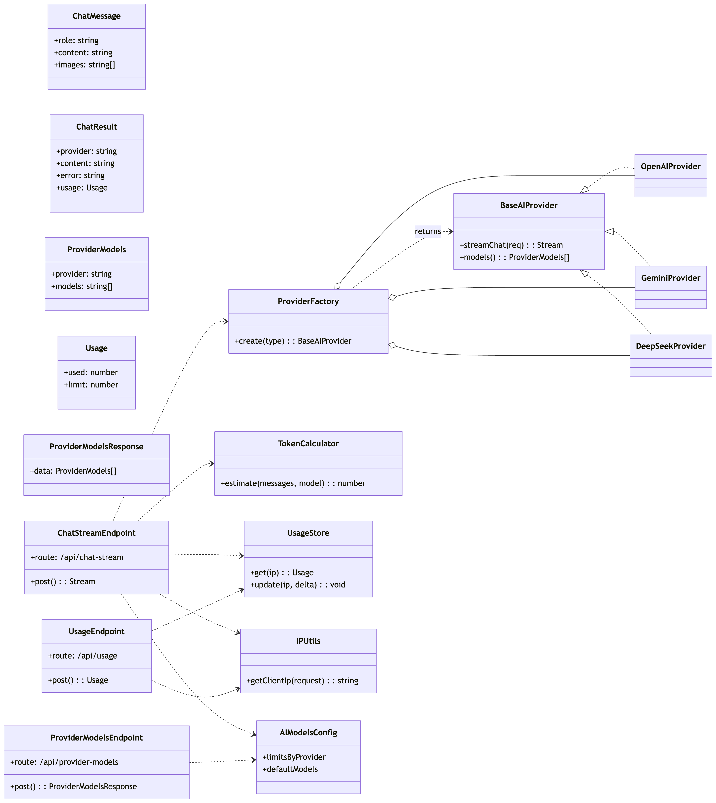

# AI Chatbot Compare

## 程式設計概述

使用 **Nuxt 4 + Vue 3 + TypeScript + Pinia + SCSS** 開發 AI 聊天比較工具，能同時與多個AI Chatbot (OpenAI / Gemini / DeepSeek) 進行聊天比較，串接各家 API ，並運用串流回應（SSE）提升使用體驗。並統計 Token 與用量限制功能。

## 使用 Cursor 提升開發效率

配置 Cursor Rules 實現 TDD 開發流程。透過測試驅動開發確保程式碼品質，自動化測試覆蓋率監控維持 80%+ 標準。整合 Conventional Commits 規範自動生成 commit message，結合 TypeScript 嚴格模式與 ESLint 提升程式碼穩定性。AI 智能補全與重構建議大幅提升開發效率，實現高品質、高穩定性的現代化前端應用。

## Demo Page

[Demo](https://ai-chatbot-compare.pages.dev/)

## User Guide

### Preparation
- 安裝 Node 20+ 與 pnpm
- 取得各家 API Key 並建立 `.env`：
```bash
NUXT_OPENAI_KEY=sk-...
NUXT_GEMINI_KEY=...
NUXT_DEEPSEEK_KEY=...
```

### Installation

1. Clone this repository:
   ```bash
   git clone https://github.com/tonys61311/ai-chatbot-compare.git
   ```

2. Navigate into the project directory：
   ```bash
   cd ai-chatbot-compare
   ```

3. Install dependencies：
   ```bash
   pnpm i
   ```

4. Start the local development server：
   ```bash
   pnpm dev #啟動 http://localhost:3000
   ```

- Classes（重點檔案）
  - 頁面/入口：[`app/pages/index.vue`](./app/pages/index.vue)
  - 狀態管理：[`app/stores/chat.ts`](./app/stores/chat.ts)
  - 前端 API Client：[`app/utils/api.ts`](./app/utils/api.ts)
  - 後端端點：[`server/api/chat-stream.post.ts`](./server/api/chat-stream.post.ts)、[`server/api/chat-batch.post.ts`](./server/api/chat-batch.post.ts)

### Usage
- 操作和各 AI Chatbot 平台相似。
- 啟動後預設模型，亦可手動選擇模型，輸入訊息即可對話。
- 支援圖片上傳（依模型能力）。

## Developer Guide

### Stack used
- **Vue 3**
- **Nuxt 4**
- **TypeScript**
- **Pinia**
- **SCSS**
- **Vitest**

## 專案結構

```
./                                  # 專案根目錄
├── app/                            # 前端應用程式（Nuxt 應用）
│   ├── app.vue                     # Nuxt 根元件
│   ├── assets/
│   │   └── scss/
│   │       └── main.scss           # 全域 SCSS 樣式
│   ├── components/                 # UI 元件
│   │   ├── ChatInput.vue           # 聊天輸入框
│   │   ├── ChatInput.spec.ts       # ChatInput 單元測試
│   │   ├── ChatWindow.vue          # 聊天視窗/對話列表
│   │   ├── ChatWindow.spec.ts      # ChatWindow 單元測試
│   │   ├── CodeMarkdown.vue        # 程式碼區塊/Markdown 呈現
│   │   ├── CodeMarkdown.spec.ts    # CodeMarkdown 單元測試
│   │   ├── UsageDisplay.vue        # 用量/限制顯示區塊
│   │   ├── UsageDisplay.spec.ts    # UsageDisplay 單元測試
│   │   └── common/                 # 通用元件
│   │       ├── Dropdown.vue                    # 基礎下拉選單
│   │       ├── Dropdown.spec.ts                # Dropdown 測試
│   │       ├── FilePreview.vue                 # 檔案預覽
│   │       ├── FilePreview.spec.ts             # FilePreview 測試
│   │       ├── FileUploadDropdown.vue          # 檔案上傳下拉選單
│   │       ├── FileUploadDropdown.spec.ts      # FileUploadDropdown 測試
│   │       ├── IconButton.vue                  # 圖示按鈕
│   │       ├── Modal.vue                       # Modal 元件
│   │       ├── Modal.spec.ts                   # Modal 測試
│   │       └── ModalHost.vue                   # Modal 掛載宿主
│   ├── composables/
│   │   ├── useAnimatedNumber.ts    # 數字動畫 Hook
│   │   ├── useAutoScroll.ts        # 自動捲動（串流訊息）
│   │   └── useModal.ts             # Modal 開關/alert 等 API
│   ├── layouts/                    # Nuxt 版型
│   ├── middleware/                 # Nuxt 中介層
│   ├── pages/
│   │   ├── index.vue               # 首頁
│   │   └── index.spec.ts           # 首頁測試
│   ├── plugins/                    # Nuxt 外掛
│   ├── providers/
│   │   └── ui/
│   │       ├── base.ts             # UI Provider 基礎型別/行為
│   │       ├── factory.ts          # UI Provider 工廠
│   │       └── providers.ts        # UI Provider 註冊清單
│   ├── stores/
│   │   ├── chat.ts                 # 聊天狀態（訊息、串流、用量）
│   │   ├── chat.spec.ts            # Chat store 測試
│   │   └── chat-stream.spec.ts     # 串流行為測試
│   ├── types/
│   │   ├── ai.ts                   # 提供者/模型等型別
│   │   ├── api.ts                  # API 型別匯出入口
│   │   └── api/
│   │       ├── chat-batch.ts               # 批次聊天 Request/Response 型別
│   │       ├── chat-batch.spec.ts          # 型別測試
│   │       ├── chat-stream.ts              # 串流聊天 Request/Chunk 型別
│   │       ├── chat-stream.spec.ts         # 型別測試
│   │       └── provider-models.ts          # 模型清單回應型別
│   └── utils/
│       ├── api.ts                 # 前端 API Client（含 SSE 解析）
│       ├── api.spec.ts            # API Client 測試
│       ├── helpers.ts             # 共用工具/字串處理
│       └── theme.ts               # 主題/色彩工具
├── public/                         # 公開靜態資源
│   ├── favicon.ico                 # 網站圖示
│   └── robots.txt                  # 搜尋引擎爬蟲設定
├── server/                         # 後端（Nitro）
│   ├── ai/
│   │   ├── adapter.ts             # 統一執行 chat（封裝 providers）
│   │   ├── base.ts                # BaseAIProvider 抽象與串流介面
│   │   ├── factory.ts             # Provider 工廠（讀 runtimeConfig）
│   │   ├── models.spec.ts         # Provider 模型/型別測試
│   │   └── providers.ts           # OpenAI/Gemini/DeepSeek 具體實作
│   ├── api/
│   │   ├── __tests__/
│   │   │   ├── chat-batch.post.spec.ts     # 批次聊天端點測試
│   │   │   ├── chat-stream.post.spec.ts    # 串流端點測試
│   │   │   ├── models.post.spec.ts         # 模型清單端點測試
│   │   │   └── rate-limit.spec.ts          # 用量限制測試
│   │   ├── chat-batch.post.ts              # 批次聊天端點（回傳 { data }）
│   │   ├── chat-stream.post.ts             # SSE 串流端點（回報用量）
│   │   ├── provider-models.post.ts         # 模型清單端點
│   │   └── usage.post.ts                   # 查詢目前用量
│   ├── config/
│   │   └── ai-models.ts          # 各 Provider 模型與預設限制
│   └── utils/
│       ├── ip.ts                 # 取得/正規化客戶端 IP
│       ├── token-calculator.spec.ts # Token 工具測試
│       ├── token-calculator.ts   # Token 計算與估算
│       └── usage-store.ts        # 以 IP 為 key 的用量儲存
├── tests/
│   └── setup.ts                  # 測試初始化（jsdom 等）
├── .gitignore                      # Git 忽略規則
├── nuxt.config.ts                  # Nuxt 設定（preset: cloudflare-pages, runtimeConfig）
├── package.json                    # 指令與相依套件
├── pnpm-lock.yaml                  # pnpm 鎖定檔
├── tsconfig.json                   # TypeScript 設定
└── vitest.config.ts              # Vitest 設定
```


## 核心特色

| 模組 | 說明 |
| ---- | ---- |
| 多提供者聊天比較 | 支援 OpenAI / Gemini / DeepSeek，集中於同一 UI 流程比對回應品質與速度 |
| 圖片上傳 | 支援圖片上傳，並顯示在聊天視窗中 |
| 串流回應（SSE） | 伺服器端以 `text/event-stream` 推送；前端邊收邊渲染，提供思考中提示與完成訊號 |
| 解析 AI 回應之Markdown 語法 | 解析 Markdown 語法並顯示，針對程式碼部分提供可複製功能 |
| 使用量與 Token 限制 | 計算 Token 使用量，限制使用量，超過上限時阻擋 |
| 可重用 UI 元件 | `ChatWindow`、`ChatInput`、`CodeMarkdown`、`FileUploadDropdown`、`Modal` 等 |


## 程式邏輯與核心流程

### 1. 首頁互動 [`pages/index.vue`](./app/pages/index.vue) + [`stores/chat.ts`](./app/stores/chat.ts)
- 進入頁面呼叫 `useChatStore().initData()`：讀取可用模型清單與目前使用量
- 送出訊息（批次）使用 `apiClient.chatBatch`；串流使用 `apiClient.chatStream`

### 2. 狀態管理 (Pinia)
#### [`stores/chat.ts`](./app/stores/chat.ts)
- `byProvider` 儲存各提供者的訊息、loading 與 streaming 狀態
- `models` 快取各提供者模型清單；`usage` 保存目前使用量與上限

### 3. UI 元件設計

- **ChatWindow**：[`app/components/ChatWindow.vue`](./app/components/ChatWindow.vue)
  - 職責：單一提供者聊天視窗，整合模型選擇、訊息列表、串流狀態、輸入列
  - props：`provider: BaseAIProviderUI`
  - emits：無（對外以 `defineExpose({ send })` 暴露方法）
  - 主要互動：`send(text, images)`、`useStreaming`、自動捲動 `useAutoScroll`

- **ChatInput**：[`app/components/ChatInput.vue`](./app/components/ChatInput.vue)
  - 職責：輸入與送出行為（含圖片上傳支援）
  - props：`send: (text: string, imgUrls: string[]) => Promise<boolean>`、`supportsImages`、`loading`
  - emits：`file-selected`（檔案選擇）

- **CodeMarkdown**：[`app/components/CodeMarkdown.vue`](./app/components/CodeMarkdown.vue)
  - 職責：將文字以 Markdown/程式碼區塊呈現，支援複製
  - props：`content: string`

- **FileUploadDropdown**：[`app/components/common/FileUploadDropdown.vue`](./app/components/common/FileUploadDropdown.vue)
  - 職責：上傳圖片並以下拉方式管理已選檔案
  - emits：`file-selected`（回傳圖片 URL 陣列）

- **Dropdown**：[`app/components/common/Dropdown.vue`](./app/components/common/Dropdown.vue)
  - 職責：泛用下拉選單，用於模型切換
  - v-model：`modelValue`；props：`data: {label,value}[]`

- **Modal / ModalHost**：[`app/components/common/Modal.vue`](./app/components/common/Modal.vue) / [`app/components/common/ModalHost.vue`](./app/components/common/ModalHost.vue)
  - 職責：全域對話框呈現；搭配 `useModal()` 控制 alert/confirm

### 4. API 設計
#### `簡易類圖`


- [`server/api/chat-batch.post.ts`](./server/api/chat-batch.post.ts)：一次送多個 `ModelChat`，回傳 `ChatResult[]` 包在 `{ data }`
- [`server/api/chat-stream.post.ts`](./server/api/chat-stream.post.ts)：SSE 串流，片段格式見下；結束時回傳 usage 匯總（`done`）
- [`server/api/provider-models.post.ts`](./server/api/provider-models.post.ts)：依提供者列出可用模型，回傳 `{ data: ProviderModels[] }`
- [`server/api/usage.post.ts`](./server/api/usage.post.ts)：回傳 `{ used, limit }`（不包 `data`）

#### `AI Provider 抽象設計`
- [`server/ai/base.ts`](./server/ai/base.ts) 定義 `BaseAIProvider` 介面與泛型串流介面
- [`server/ai/factory.ts`](./server/ai/factory.ts) 依 `AIProviderType` 產生對應實作；讀取 `runtimeConfig` 中的 API Key
- [`server/config/ai-models.ts`](./server/config/ai-models.ts) 彙整各提供者可用模型與預設限制
